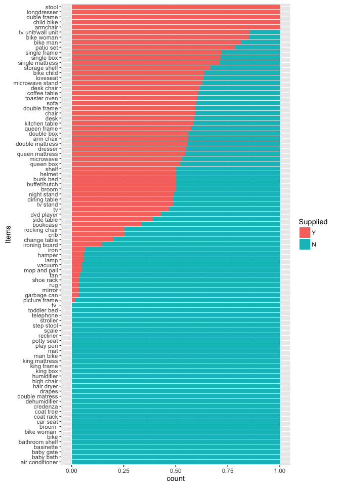
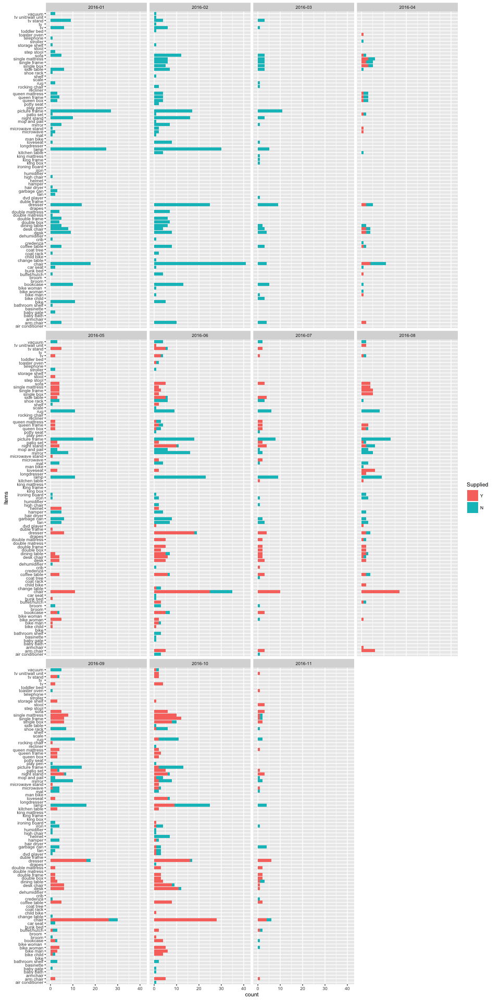
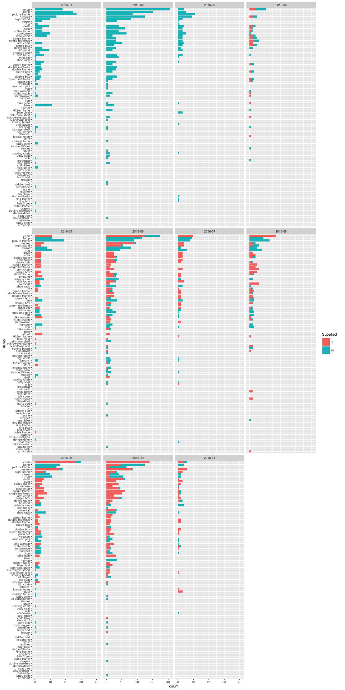

HWF Data Summary
================
Dewey Dunnington
11/19/2016

Libraries

``` r
library(prettymapr)
library(dplyr)
library(ggplot2)
library(ggspatial)
library(reshape2)
```

Load in data

``` r
mt <- read.csv('data/monthly_totals.csv', stringsAsFactors = FALSE)
mt$posix <- lubridate::dmy(mt$Date)
mt$posix[is.na(mt$posix)] <- lubridate::mdy(mt$Date[is.na(mt$posix)])
mt$month <- paste(lubridate::year(mt$posix),sprintf('%0.2d', lubridate::month(mt$posix)), sep="-")
mt$Items <- tolower(mt$Items)
mt$Supplied[mt$Supplied != "Y"] <- "N"
mt$Supplied <- factor(mt$Supplied, levels=c("Y", "N"))
mtgeo <- read.csv('data/monthly_totals_postals.csv')

deliveries <- mt %>% group_by(posix, Delivery.ID) %>% 
  summarise(Geo=unique(Geo), nitems=length(Items), 
            nyes=sum(Supplied=="Y"), nno=sum(Supplied=="N")) %>% 
  merge(mtgeo, by='Geo', all.x=T) %>% 
  select(posix, Delivery.ID, nitems, nyes, nno, postal, lon, lat)
```

Plot geo

``` r
ggplot(deliveries, aes(lon, lat)) + geom_osm() + geom_spatial(mapping=aes(size=nitems)) +
  scale_size()
```

<!-- -->

Tabular summary by items

``` r
mtsum <- mt %>% group_by(Items) %>% 
  summarise(SuppliedY=sum(Supplied=="Y"), 
            SuppliedN=length(Supplied)-SuppliedY, 
            Total=length(Supplied))
mtsumtot <- rbind(mtsum[order(mtsum$Total, decreasing = T),], data.frame(Items="Totals", SuppliedY=sum(mtsum$SuppliedY),
                                 SuppliedN=sum(mtsum$SuppliedN),
                                 Total=sum(mtsum$Total)))
# knitr::kable(mtsumtot)
```

Graphical summary by items

``` r
# plot by order of item frequency
mtsummelt <- mt %>% select(Items, Supplied, month)
mtsummelt$Items <- factor(mtsummelt$Items, levels=mtsum$Items[order(mtsum$Total)])
ggplot(mtsummelt, aes(x=Items, fill=Supplied)) + coord_flip() + stat_count()
```

<!-- -->

``` r
# plot proportion
ggplot(mtsummelt, aes(x=Items, fill=Supplied)) + coord_flip() + stat_count(position='fill')
```

<!-- -->

``` r
# plot by order of proportion
mtsummelt$Items <- factor(mtsummelt$Items, levels=mtsum$Items[order(mtsum$SuppliedY/mtsum$Total)])
ggplot(mtsummelt, aes(x=Items, fill=Supplied)) + coord_flip() + stat_count(position='fill')
```

<!-- -->

``` r
mtsummelt$Items <- factor(mtsummelt$Items, levels=mtsum$Items[order(mtsum$Total)])
ggplot(mtsummelt, aes(x=Items, fill=Supplied)) + coord_flip() + stat_count() +
  facet_wrap(~month) + theme_grey(8)
```

<!-- -->

Graphical summary by date

``` r
# plot deliveries over time
deliverymelt <- deliveries %>% melt(id.vars=c("posix", "Delivery.ID", "nitems", "postal"),
                                    measure.vars=c("nyes", "nno"), value.name="itemcount",
                                    variable.name="Supplied")
ggplot(deliverymelt, aes(x=posix, y=itemcount, fill=Supplied)) + geom_bar(stat='identity')
```

<!-- -->
