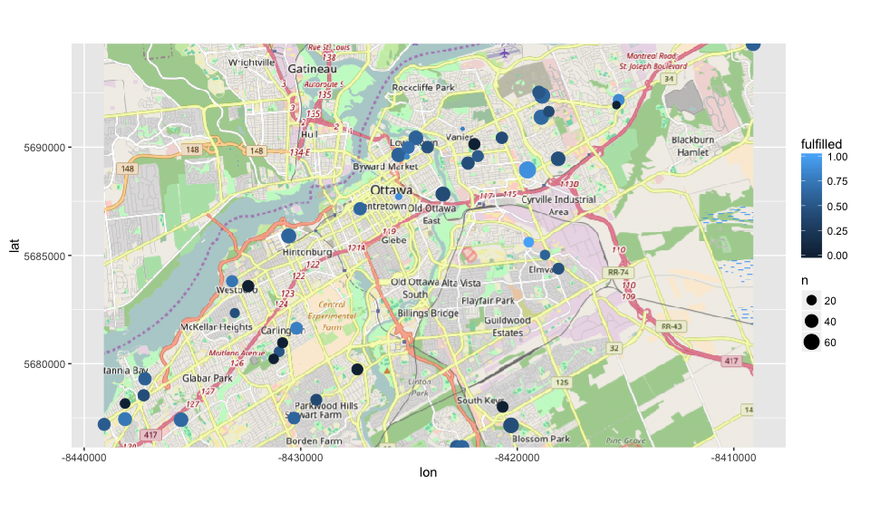
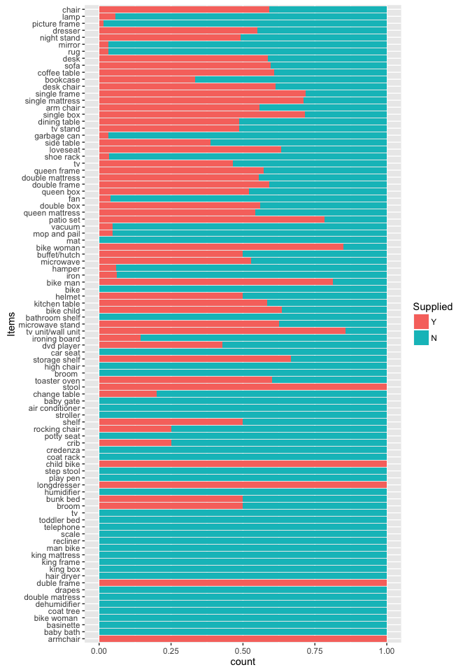

HWF Data Summary
================
Dewey Dunnington
11/19/2016

Libraries

``` r
library(prettymapr)
library(dplyr)
library(ggplot2)
library(ggspatial)
library(reshape2)
```

Load in data

``` r
mt <- read.csv('data/monthly_totals.csv', stringsAsFactors = FALSE)
mt$posix <- lubridate::dmy(mt$Date)
mt$posix[is.na(mt$posix)] <- lubridate::mdy(mt$Date[is.na(mt$posix)])
mt$Date <- as.character(mt$posix)
mt$Items <- tolower(mt$Items)
mt$Supplied[mt$Supplied != "Y"] <- "N"
mtgeo <- read.csv('data/monthly_totals_postals.csv')
```

Plot geo

``` r
ggplot(mtgeo, aes(lon, lat)) + geom_osm() + geom_spatial(mapping=aes(size=n)) +
  scale_size()
```

    ## Zoom: 12

<!-- -->

Tabular summary by items

``` r
mtsum <- mt %>% group_by(Items) %>% 
  summarise(SuppliedY=sum(Supplied=="Y"), 
            SuppliedN=length(Supplied)-SuppliedY, 
            Total=length(Supplied))
mtsumtot <- rbind(mtsum[order(mtsum$Total, decreasing = T),], data.frame(Items="Totals", SuppliedY=sum(mtsum$SuppliedY),
                                 SuppliedN=sum(mtsum$SuppliedN),
                                 Total=sum(mtsum$Total)))
knitr::kable(mtsumtot)
```

| Items             |  SuppliedY|  SuppliedN|  Total|
|:------------------|----------:|----------:|------:|
| chair             |        125|         86|    211|
| lamp              |          9|        148|    157|
| picture frame     |          2|        138|    140|
| dresser           |         70|         57|    127|
| night stand       |         35|         36|     71|
| mirror            |          2|         62|     64|
| rug               |          2|         59|     61|
| desk              |         34|         24|     58|
| sofa              |         31|         21|     52|
| bookcase          |         17|         34|     51|
| coffee table      |         31|         20|     51|
| desk chair        |         30|         19|     49|
| single frame      |         33|         13|     46|
| single mattress   |         32|         13|     45|
| arm chair         |         24|         19|     43|
| single box        |         30|         12|     42|
| dining table      |         19|         20|     39|
| tv stand          |         17|         18|     35|
| garbage can       |          1|         31|     32|
| side table        |         12|         19|     31|
| loveseat          |         19|         11|     30|
| shoe rack         |          1|         28|     29|
| queen frame       |         16|         12|     28|
| tv                |         13|         15|     28|
| double frame      |         16|         11|     27|
| double mattress   |         15|         12|     27|
| double box        |         14|         11|     25|
| fan               |          1|         24|     25|
| queen box         |         13|         12|     25|
| queen mattress    |         13|         11|     24|
| patio set         |         18|          5|     23|
| mat               |          0|         21|     21|
| mop and pail      |          1|         20|     21|
| vacuum            |          1|         20|     21|
| bike woman        |         17|          3|     20|
| buffet/hutch      |          9|          9|     18|
| hamper            |          1|         16|     17|
| microwave         |          9|          8|     17|
| bike              |          0|         16|     16|
| bike man          |         13|          3|     16|
| iron              |          1|         15|     16|
| helmet            |          7|          7|     14|
| kitchen table     |          7|          5|     12|
| bike child        |          7|          4|     11|
| bathroom shelf    |          0|          9|      9|
| microwave stand   |          5|          3|      8|
| car seat          |          0|          7|      7|
| dvd player        |          3|          4|      7|
| ironing board     |          1|          6|      7|
| tv unit/wall unit |          6|          1|      7|
| broom             |          0|          6|      6|
| high chair        |          0|          6|      6|
| storage shelf     |          4|          2|      6|
| air conditioner   |          0|          5|      5|
| baby gate         |          0|          5|      5|
| change table      |          1|          4|      5|
| stool             |          5|          0|      5|
| toaster oven      |          3|          2|      5|
| crib              |          1|          3|      4|
| potty seat        |          0|          4|      4|
| rocking chair     |          1|          3|      4|
| shelf             |          2|          2|      4|
| stroller          |          0|          4|      4|
| child bike        |          3|          0|      3|
| coat rack         |          0|          3|      3|
| credenza          |          0|          3|      3|
| broom             |          1|          1|      2|
| bunk bed          |          1|          1|      2|
| humidifier        |          0|          2|      2|
| longdresser       |          2|          0|      2|
| play pen          |          0|          2|      2|
| step stool        |          0|          2|      2|
| armchair          |          1|          0|      1|
| baby bath         |          0|          1|      1|
| basinette         |          0|          1|      1|
| bike woman        |          0|          1|      1|
| coat tree         |          0|          1|      1|
| dehumidifier      |          0|          1|      1|
| double matress    |          0|          1|      1|
| drapes            |          0|          1|      1|
| duble frame       |          1|          0|      1|
| hair dryer        |          0|          1|      1|
| king box          |          0|          1|      1|
| king frame        |          0|          1|      1|
| king mattress     |          0|          1|      1|
| man bike          |          0|          1|      1|
| recliner          |          0|          1|      1|
| scale             |          0|          1|      1|
| telephone         |          0|          1|      1|
| toddler bed       |          0|          1|      1|
| tv                |          0|          1|      1|
| Totals            |        809|       1255|   2064|

Graphical summary by items

``` r
# plot by order of item frequency
mtsummelt <- mt %>% select(Items, Supplied)
mtsummelt$Items <- factor(mtsummelt$Items, levels=mtsum$Items[order(mtsum$Total)])
ggplot(mtsummelt, aes(x=factor(Items), fill=Supplied)) + coord_flip() + stat_count()
```

<!-- -->

``` r
# plot by order of proportion
mtsummelt$Items <- factor(mtsummelt$Items, levels=mtsum$Items[order(mtsum$SuppliedY/mtsum$Total)])
ggplot(mtsummelt, aes(x=factor(Items), fill=Supplied)) + coord_flip() + stat_count(position='fill')
```

<!-- -->

Graphical summary by date
